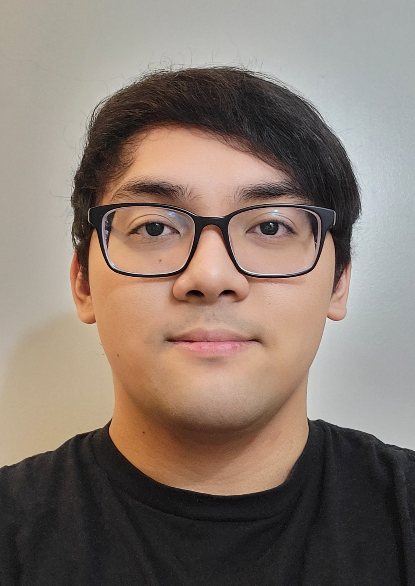

# About me

## Web Dev Spring 2023

<picture>
    
</picture>

My name is Manuel Reyes, and I am a Computer Science major. I am a transfer student from Dutchess Community College. I have taken these computer science related classes at New Paltz: Operating Systems, Object Oriented Programming, and Computer Science 3. Currently, I am taking Web Server Programming, Language Processing, Software Engineering, and Discrete Algorithms. I have made a couple of simple programs, one of which includes a hangman game using Jupyter notebooks. The hangman game was created back when I was in high school and was part of a final project for a class. I have also played around with Django in Python to create a dynamic website, but never deployed it. Finally, I did some work as a ROBLOX developer for a game called Shinobi Saga. My contributions for the game mainly involved designing and creating clan moves based on characters in Naruto such as Zabuza Momochi, Konan, Hanzo the Salamander, and Temari.

Using things learned from this course, I can see myself becoming a better programmer in terms of how I design and implement solutions to problems I solve. I believe the techniques and technologies I learn can be applied to other areas of interests I may have such as being a game developer. I could see myself creating a web application for a game that would handle an economy system, saving player data, a global trading system, or other cool ideas. The ROBLOX database and message passing is quite limited so an alternate solution using third party services is necessary.
